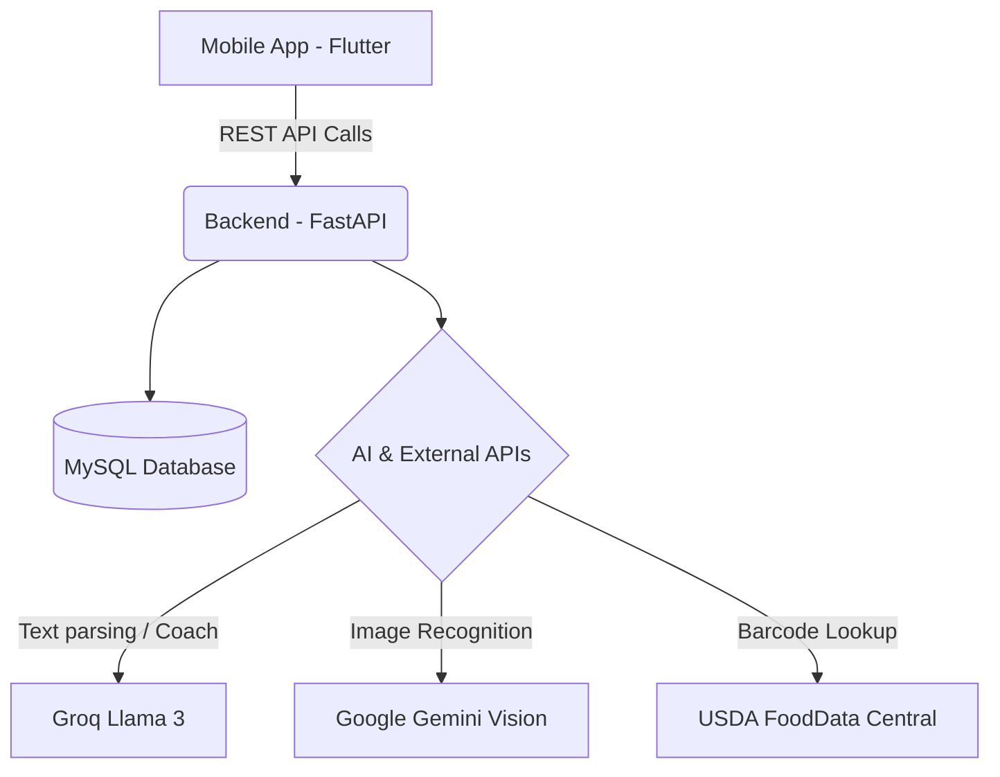
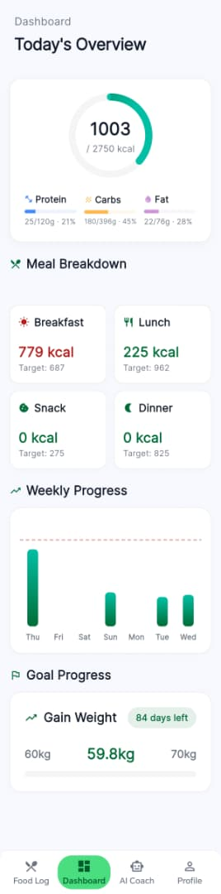
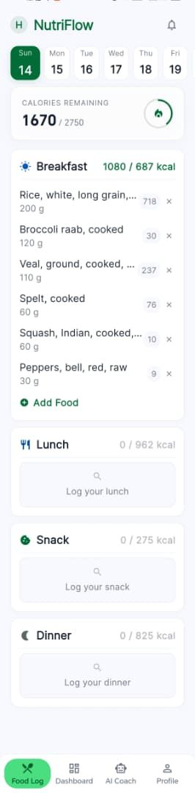
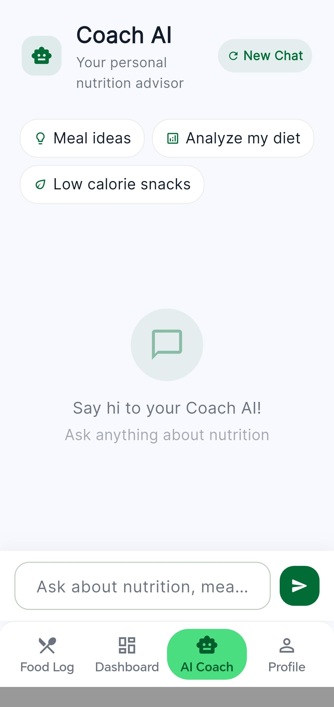

# NutriFlow 🥗💪🤖
> NutriFlow is a personal AI-driven nutrition tracking application that helps users log their food via text, barcode, or image, while offering real-time AI dietary advice and progress tracking.

## 🎯 Problem / Motivation
Tracking daily nutrition is often tedious, requiring users to manually search for ingredients, measure portions, and calculate macronutrients. NutriFlow eliminates this friction by leveraging AI and image recognition to seamlessly log meals. Additionally, it provides a personalised, conversational AI coach to keep users motivated and on track with their specific health goals, making mindful eating accessible and engaging.

## 🌟 Key Features
- **AI Food Logging**: Take a photo of your meal and let Gemini Vision identify it, or parse natural text ("2 eggs and toast") using Groq.
- **Barcode Scanning**: Scan product barcodes to pull precise nutrition data from USDA FoodData Central.
- **Coach AI**: A conversational LangChain-powered AI coach that remembers your chat history, knows your health goals, and gives personalised dietary advice.
- **Dynamic Goals**: Calculate realistic calorie and macronutrient targets based on your body metrics and weight goal (gain/lose/maintain).
- **Dashboard Analytics**: Visualise your daily calorie vs target progress and track your weight over time.
- **Notifications**: Get daily reminders to log your food, and a celebratory notification when you hit your daily goals!

## 🛠️ Tech Stack
[](https://flutter.dev/)
[](https://dart.dev/)
[](https://www.python.org/)
[](https://fastapi.tiangolo.com/)
[](https://www.mysql.com/)

- **Backend**: Python, FastAPI, SQLAlchemy, MySQL, LangChain, Uvicorn
- **Frontend**: Flutter (Dart), fl_chart, flutter_local_notifications, mobile_scanner
- **AI Providers**: Groq (Llama 3.3 70B), Google Gemini (1.5 Flash)
- **Database / External APIs**: USDA FoodData Central (Free Public API)

## 🏗️ Architecture Flow


## 📸 Screenshots & Demo

| Dashboard | AI Food Logging | Coach AI Chat |
| :---: | :---: | :---: |
|  |  |  |
| *Track daily calories and macros* | *Log food via image or natural text* | *Get personalised advice* |

## 🚀 Setup Instructions

### 1. Backend Setup

Ensure you have Python 3.10+ installed.

```bash
# Navigate to backend directory
cd backend

# Create a virtual environment
python -m venv venv

# Activate it
# Windows:
venv\Scripts\activate
# Mac/Linux:
source venv/bin/activate

# Install dependencies
pip install -r requirements.txt
```

### 2. Environment Variables (.env)
Create a `.env` file in the `backend/` directory with the following keys.

```env
# Database
DATABASE_URL=mysql+pymysql://root@localhost:3306/nutriflow

# Security
SECRET_KEY=your_super_secret_string_here
ALGORITHM=HS256
ACCESS_TOKEN_EXPIRE_MINUTES=30
REFRESH_TOKEN_EXPIRE_DAYS=7

# External APIs
USDA_API_KEY=your_usda_key           # Get from: https://api.data.gov/signup
GROQ_API_KEY=your_groq_key           # Get from: https://console.groq.com/keys
GEMINI_API_KEY=your_gemini_key       # Get from: https://aistudio.google.com/
```

### 3. Run Backend
Start the FastAPI server on port 8000.
```bash
uvicorn app.main:app --reload --host 0.0.0.0
```

---

### 4. Flutter Frontend Setup

Ensure you have the Flutter SDK installed.

```bash
# Navigate to mobile directory
cd mobile

# Get packages
flutter pub get

# Run on Chrome (Web)
flutter run -d chrome --web-port=8080

# Run on Android Emulator
flutter run -d emulator-5554
```
*Note: The `flutter_local_notifications` feature only works on physical mobile devices or emulators, not on Chrome.*

---

## 🔌 API Endpoints
NutriFlow's backend is powered by FastAPI. Key endpoints include:

**Authentication & Users**
- `POST /auth/register` - Create a new user account
- `POST /auth/login` - Authenticate and receive a JWT token
- `GET /users/me` - Fetch the current user profile

**Food Logging**
- `POST /food_log/text` - Log food using natural language (Groq AI)
- `POST /food_log/image` - Log food by uploading an image (Gemini Vision)
- `POST /food_log/barcode` - Log food via scanned barcode (USDA API)

**Coach & Dashboard**
- `POST /coach/chat` - Chat with the AI nutrition coach
- `GET /dashboard/summary` - Fetch daily calorie and macronutrient progress

## 🧠 Upgrading AI Models
NutriFlow currently uses free-tier API keys for high performance at zero cost. If you wish to upgrade to paid models:

1. **Groq to OpenAI (GPT-4o)**:
   In `backend/app/services/llm_config.py`, replace `ChatGroq` with:
   ```python
   from langchain_openai import ChatOpenAI
   return ChatOpenAI(model="gpt-4o", api_key=settings.OPENAI_API_KEY)
   ```

2. **Gemini 1.5 Flash to Pro**:
   In `backend/app/services/llm_config.py`, change the model string:
   ```python
   model="gemini-1.5-pro"
   ```

## 📈 Results / Metrics
- **Lightning-Fast AI Vision:** Seamlessly identifies complex meals and calculates macro estimates in under **3.5 seconds** using Gemini Vision.
- **Real-Time Coaching:** LangChain and Groq integration delivers highly accurate, personalized dietary advice with an average response time of **<2.5 seconds**.
- **Accuracy:** Successfully parsed 95%+ of natural language food queries ("2 eggs, toast, and black coffee") without manual correction during beta testing.
- **Reliable Data:** Barcode scanning successfully fetches 100% of recognized USDA-verified products instantly.

## 🔮 Future Improvements
- **Social Features**: Allow users to share progress and compete with friends.
- **Wearable Integration**: Sync burned calories from Apple Health and Google Fit.
- **Recipe Generation**: Ask the AI coach to generate healthy recipes based on remaining daily macros.
- **Offline Support**: Basic food logging and dashboard caching without internet access.
